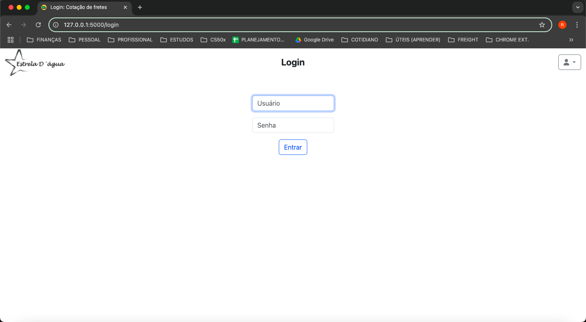
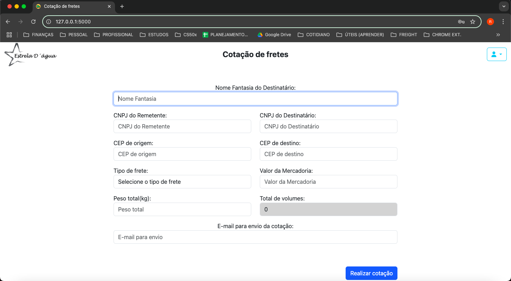
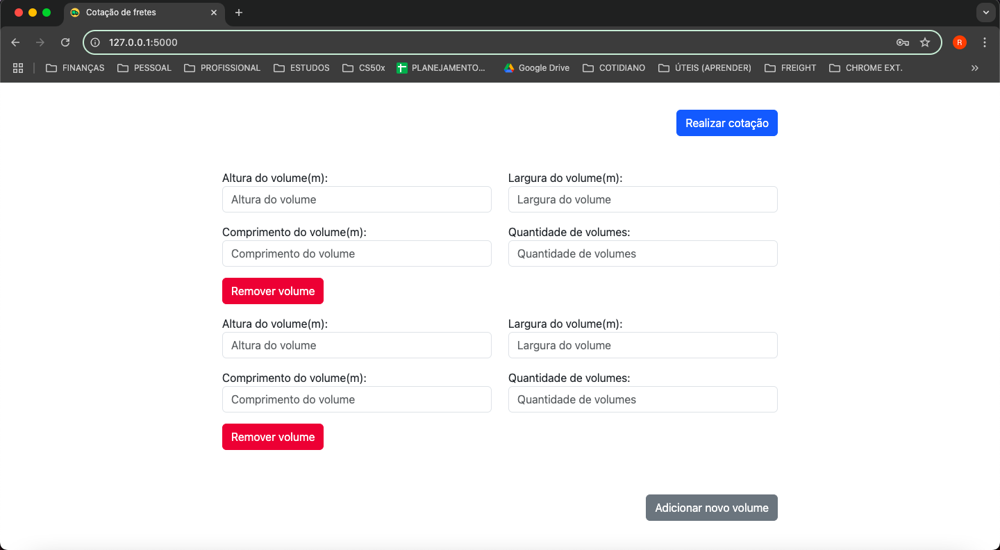
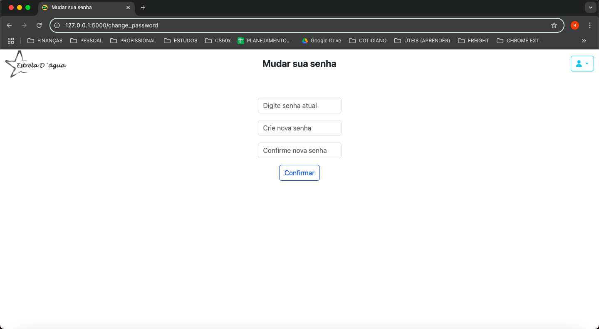
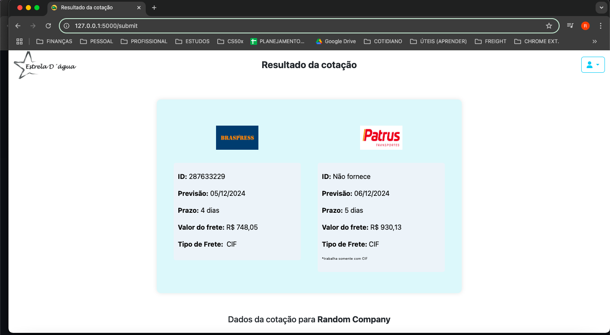
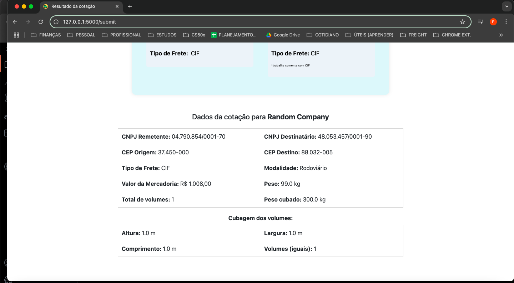
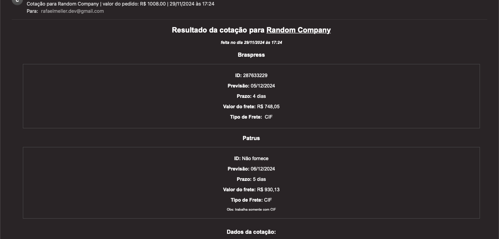
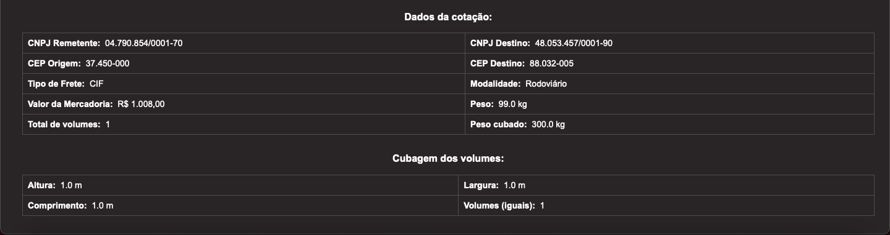

<h1 align="center" style="font-weight: bold;">Projeto Freight Quoter</h1>

<div align="center">
    
    
    
</div>

###### _Outras versões:_ [_Click here for English_](./README.md)

<h4 align="center"> 
         <b>Status:</b> Ativo – Funcionalidades em Desenvolvimento 🚧
</h4>

<p align="center">
 <a href="#sobre-ℹ️">Sobre</a> •
 <a href="#contextualizando-📦">Contextualizando</a> •
 <a href="#funcionalidades-🌟">Funcionalidades</a> •
 <a href="#layout-🎨">Layout</a> • 
 <a href="#demonstração-do-projeto-🖥️">Demonstração do Projeto</a> •
 <a href="#arquitetura-do-aplicativo-🏗️">Arquitetura do Aplicativo</a> •
 <a href="#apis-de-frete-conectadas-🚛">APIs de Frete Conectadas</a> •
 <a href="#configuração-⚙️">Configuração</a> • 
 <a href="#proximos-passos-e-desafios-🛠️">Próximos Passos e Desafios</a> •
 <a href="#autor-👨🏻‍💻">Autor</a> • 
 <a href="#licença-📝">Licença</a>
</p>

## Sobre ℹ️
Este projeto foi criado como o trabalho final para o CS50, o curso de Introdução à Ciência da Computação de Harvard. É uma aplicação web para cotação de fretes, que permite, aos usuários de uma empresa, inserir detalhes de uma carga para envio e obter cotações de diversas transportadoras simultaneamente, eliminando a necessidade de consultas individuais.

A aplicação foi desenvolvida utilizando Flask e Asyncio no backend, e JavaScript, CSS e HTML no frontend.

#
## Contextualizando 📦

O aplicativo foi criado para a Estrela D'Água, uma cooperativa em Aiuruoca, Brasil, que produz e comercializa estátuas para lojas em todo o país. Ele otimiza o processo de cotação de frete ao automatizar as interações com transportadoras parceiras, economizando tempo e reduzindo o esforço para realizar tais cotações.

#
## Funcionalidades 🌟

- **Cotação Multi-Transportadora**: Obtém cotações de multiplas transportadoras em uma única solicitação, reduzindo o tempo e o trabalho necessários.
- **Integração de API Assíncrona**: Realiza chamadas de API assíncronas para fornecer estimativas de custos e prazos em tempo real, minimizando o tempo gasto nas requisições às APIs.
- **Autenticação Segura**: Inclui login com senhas criptografadas, garantindo que apenas usuários autorizados da empresa tenham acesso ao sistema.
- **Validação e Sanitização de Dados**: Os dados inseridos pelos usuários são verificados e sanitizados para evitar erros e entradas maliciosas, além de facilitar o preenchimento.
- **Notificações por Email**: Após gerar uma cotação, o sistema envia um email com os detalhes, facilitando o acompanhamento e registrando as cotações devidamente.
- **Escalabilidade**: Projetado para incorporar novas APIs ou funcionalidades adicionais, adaptando-se à futuras necessidades.

#
## Layout 🎨









#
## Demonstração do Projeto 🖥️
[Clique aqui para assistir à demonstração gravada](https://youtu.be/yyReQaEZ6eQ)

##### Devido à utilização de credenciais privadas, a demonstração está disponível apenas em formato gravado.

#
## Arquitetura do Aplicativo 🏗️

1. **Backend (Flask)**:  
     - Gerencia a autenticação, envio de formulários e chamadas às APIs das transportadoras.
     - Utiliza solicitações HTTP assíncronas para buscar dados atualizados de custos e prazos.
     - Processa, valida e sanitiza dados antes de enviá-los ao frontend.
     
2. **Frontend (HTML, CSS, JavaScript)**:  
     - Oferece uma interface amigável para inserir informações de envio, como origem, destino e peso.
     - Permite adicionar volumes dinamicamente e calcula o peso cúbico automaticamente.
     - Apresenta os resultados de forma clara e organizada, com design responsivo para diferentes dispositivos.

3. **APIs Externas**:  
     - Integra-se atualmente com duas APIs de transportadoras, que são as mais utilizadas pela Estrela D'Água, buscando informações de frete em tempo real.
     - As chamadas assíncronas garantem um tempo de resposta reduzido, embora dependam do tempo de resposta das APIs.

4. **Banco de Dados (Futuro)**:  
    - Embora ainda não utilize, a arquitetura está preparada para inclusão de um banco de dados, possibilitando armazenamento de cotações, usuários e outros dados relevantes.

    ### **Fluxo de Trabalho**:  

    1. **Login do Usuário**: Usuários se autenticam via backend.
    2. **Solicitação de Cotação de Frete**: O usuário insere detalhes de envio via frontend.
    3. **Chamadas de API**: O backend busca dados de APIs externas e faz a validação dos dados.
    4. **Manipulação de Resultados**: Cotações são processadas e exibidas ao em uma página de resultados usuário.
    5. **Confirmação por Email**: Um email de confirmação é enviado ao usuário.

#
## APIs de Frete Conectadas 🚛

O aplicativo utiliza APIs para obter cotações e prazos.
###### _Nota: todos os comentários presentes dentro dos exemplos json devem ser removidos, já que estão presentes somente a nivel de instrução._
#
### Transportadora: Braspress
[Site da Braspress](https://www.braspress.com/acesso-rapido/cotacao-online/)

**Propósito**: Fornece custos de envio e prazos estimados.

- **Exemplo de Solicitação**:
```py
{
    "cnpjRemetente": 60701190000104, # int
    "cnpjDestinatario": 30539356867, # int
    "modal": "R", # str
    "tipoFrete": "1", # str
    "cepOrigem": 2323000, # int
    "cepDestino": 7093090, # int
    "vlrMercadoria": 100.00, # float
    "peso": 50.55, # float
    "volumes": 10, # int
    "cubagem": [
        {
            "altura": 0.46, # float
            "largura": 0.67, # float
            "comprimento": 0.67, # float
            "volumes": 10 # int
        }
    ]
}
```

- **Exemplo de Resposta**:
```py
{
    'id': 287242456, # int
    'prazo': 4, # int
    'totalFrete': 1.485,68 # float
}
```
#
### Transportadora: Patrus
[Site da API Patrus](https://api-patrus.developer.azure-api.net/)

### **API 1:**
**Propósito**: Fornece o token de acesso.
- **Exemplo de Solicitação**:
```json

data=
{
    'username': "example", # insira seu usuário 'str' aqui
    'password': "example", # insira sua senha 'str' aqui
    'grant_type': "password" # use 'password', fixo como está
},

headers=
{
    'Content-Type': 'application/x-www-form-urlencoded',
    'Subscription': "example" # substitua pelo seu token de assinatura
}  
```

- **Exemplo de Resposta**:
```py
{
    "access_token": "example", # str
    "token_type": "example", # str
    "username": "example", # str
    "expires_in": 0 # int
}
```
#
### **API 2:**
**Propósito**: Fornece custos de envio e prazos estimados.

- **Exemplo de Cabeçalhos de Solicitação POST**:

```py
{
    'Content-Type': 'application/json',
    'Authorization': f'Bearer access_token', # substitua 'access_token' pelo seu token de acesso
    'Subscription': "example" # substitua pelo seu token de assinatura
}
```
- **Exemplo de Payload de Solicitação POST**:
```py
{
    "CnpjTomador": "04.790.854/0001-70", # str
    "CepDestino": "88032-005", # str
    "CnpjCpf": "48.053.457/0001-90",  # ou "000.000.000-00" para CPF (str)
    "Carga": {
        "Volumes": 1, # int
        "Peso": 20, # int
        "ValorMercadoria": 200.00 # float
    },
}
```

- **Exemplo de Resposta**:
```py
{
    'ValorFrete': 1485.68,
    'EntregaPrevista': '2021-09-30T00:00:00'
}
```
#
## Configuração ⚙️
```bash
# Clone o repositório
git clone <repository-url>

# Acesse o diretório
cd <project-directory>

# Crie e ative o ambiente virtual
python3 -m venv venv
source venv/bin/activate

# Instale as dependências
pip install -r requirements.txt

# Configure variáveis de ambiente
cp .env.example .env

# Execute o aplicativo
flask run
```
##### _**Observações:**_
##### - _Lembre-se de editar o arquivo `.env` com suas credenciais._
##### - _O nome de usuário padrão é `main_user` e a senha padrão é `123456`._
##### - _Sinta-se à vontade para alterar o nome de usuário padrão diretamente no arquivo `.env`. No entanto, é recomendável alterar a senha através do aplicativo para evitar possíveis incompatibilidades de hash._

#
## Próximos Passos e Desafios 🛠️

- **Adicionar Integração com Banco de Dados:**
Implementar um banco de dados para armazenar informações de usuários, cotações e registros de envio, aprimorando o gerenciamento de dados.

- **Expandir Transportadoras Parceiras:**
Ampliar a integração com novos provedores de frete, aumentando a versatilidade e o alcance do sistema.

- **Automatizar Validações:**
Incluir validação automática de CEPs e requisição automática de informações de CNPJ/CPF, garantindo maior precisão nos dados inseridos.

- **Velocidade de entrega dos resultados:**
Mesmo com o uso de chamadas assíncronas, os tempos de resposta dependem das APIs externas e estas podem tardar mais que o desejado.

- **Ajustar o Controle de Acesso:**
A versão original dessa aplicação conta somente com um único usuário, já que para a Estrela D'Água não há necessidade atual de mais usuários.

- **Acesso Restrito às Credenciais e à Demonstração:**
O aplicativo utiliza credenciais específicas dos contratos de serviço da Estrela D'Água com as transportadoras Patrus e Braspress. Devido à natureza sensível dessas credenciais, elas não podem ser compartilhadas publicamente. Por esse motivo, o site não pode ser disponibilizado publicamente, apenas uma demonstração gravada do aplicativo.

#
## Autor 👨🏻‍💻

Desenvolvido por **Rafael Meller**.

[](https://www.linkedin.com/in/rafaelmeller/) 
[](mailto:rafaelmeller.dev@gmail.com)

#
## Licença 📝

Este projeto está sob a licença [MIT](./LICENSE).
