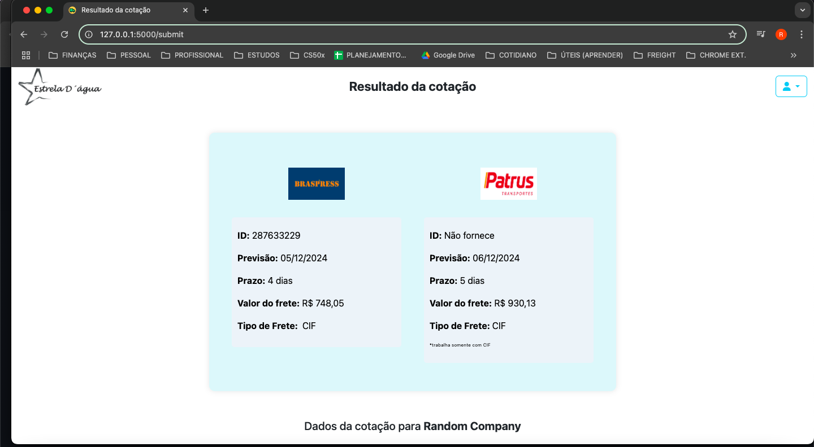
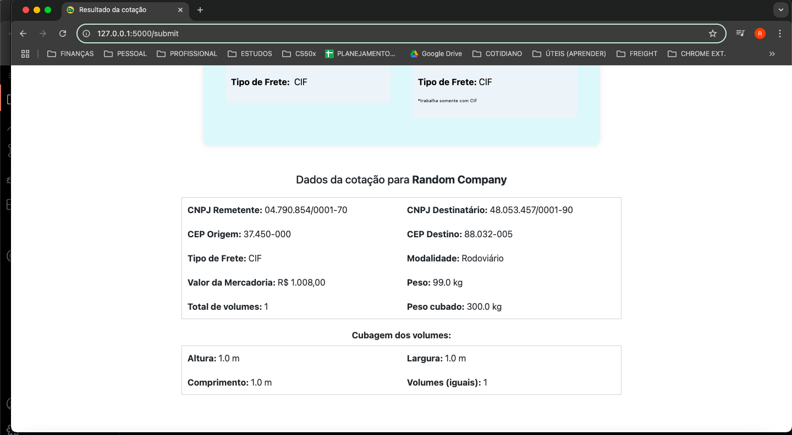
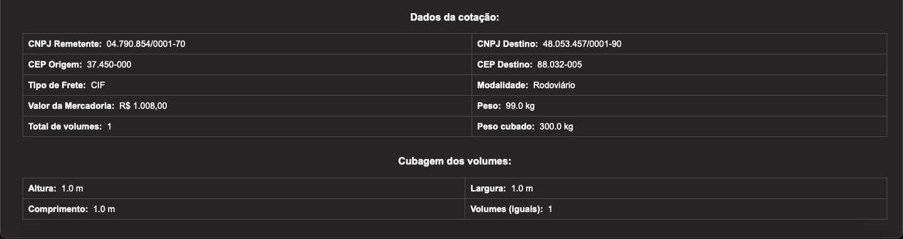

<h1 align="center" style="font-weight: bold;">Freight Quoter Project</h1>


<div align="center">
  
  
  
</div>

###### _Other versions:_ [_Clique aqui para Português_](./README-ptBR.md)

<h4 align="center"> 
     <b>Status:</b> Active – Features in Progress 🚧
</h4>

<p align="center">
 <a href="#about-ℹ️">About</a> •
 <a href="#use-case-📦">Use Case</a> •
 <a href="#features-🌟">Features</a> •
 <a href="#layout-🎨">Layout</a> • 
 <a href="#project-demo-🖥️">Project Demo</a> •
 <a href="#app-architecture-🏗️">App Architecture</a> •
 <a href="#connected-freight-apis-🚛">Connected Freight APIs</a> •
 <a href="#setup-⚙️">Setup</a> • 
<a href="#future-work-and-known-limitations-🛠️">Future Work And Known Limitations</a> •
 <a href="#author-👨🏻‍💻">Author</a> • 
 <a href="#license-📝">License</a>
</p>


## About ℹ️
This project was created as the final assignment for CS50, Harvard's Introduction to Computer Science course. It is a web application for freight quotation, which allows users from a specific company to input freight details obtain quotations from multiple freight companies simultaneously, eliminating the need to contact them individually.

It was built using Flask and Asyncio for the backend and JavaScript, CSS and html for the frontend.

#
## Use Case 📦

This web application was developed for Estrela D'Água, a small cooperative based in Aiuruoca, Brazil, that produces statues and sells them to stores across the country. The app simplifies and optimizes the freight quotation process by automating interactions with their primary freight providers, saving time and minimizing manual effort.

#
## Features 🌟

- **Multi-company Freight Quotation**: Get quotes from multiple freight companies with a single submission, saving time and effort.
- **Asynchronous API Integration**: Provides real-time cost and delivery time estimates using asynchronous API calls.
- **User Authentication**: Ensures secure access with login functionality, supporting hashed passwords for user verification. Only authorized users from the company can access the system.
- **Data Sanitization & Validation**: Input data is sanitized and validated to prevent errors and ensure accurate processing, helping to eliminate invalid or malicious inputs and making form filling much easier.
- **Email Notification**: After generating a quotation, the system sends a confirmation email with detailed information to facilitate tracking and record-keeping.
- **Scalability**: Designed to be easily scalable by integrating additional APIs for new freight companies or expanding functionality.

#
## Layout 🎨







#
## Project Demo 🖥️
[Click here to watch the recorded demo](https://youtu.be/yyReQaEZ6eQ)

##### Due to the use of private credentials, a recorded demo is provided instead of a live demo.

#
## App Architecture 🏗️

1. **Backend (Flask)**:  
   - Handles user authentication, form submissions, and API requests to various freight companies.
   - Communicates with external APIs via asynchronous HTTP requests to fetch real-time data (costs, delivery times, etc.).
   - Data is processed, validated, and sanitized before being sent to the frontend or stored.
   
2. **Frontend (HTML, CSS, JavaScript)**:  
   - Provides an intuitive, user-friendly interface for entering shipment details (e.g., source, destination, weight).
   - Dynamically adds shipment volumes with a single click and automatically calculates their cubic weight.
   - Displays the results from multiple freight companies in a clean and organized manner.
   - The frontend is designed to be responsive, ensuring compatibility across devices, including mobile.

3. **External APIs**:  
   - The application currently integrates with two freight company APIs, which are the most frequently used by Estrela D'Água. It Fetches and parses real-time freight information. 
   - Asynchronous calls ensure that the time taken is as short as possible (yet it still depends on the API response times).

4. **Database (Future Scalability)**:  
   - Although the current version does not include a database, the architecture can be extended to incorporate one, enabling storage of user data, quotations, and shipping records.

   ### **Workflow**:  
    1. **User Login**: Users authenticate via the backend.
    2. **Freight Quote Request**: The user enters shipment details via the frontend.
    3. **API Calls**: The backend fetches data from external APIs and validates it.
    4. **Result Handling**: Quotes are processed and displayed to the user in a result page.
    5. **Email Confirmation**: A confirmation email is sent to the user.

#
## Connected Freight APIs 🚛

The app connects to external APIs to fetch real-time shipping rates and delivery times:
###### _Note: all the comments inside the json examples should be removed, as they are only explaining each field._
#
### Freight Company: Braspress
[Braspress Website](https://www.braspress.com/acesso-rapido/cotacao-online/)

**Purpose**: Provides shipping costs and estimated delivery times.

- **Example Request**:
```json
{
  "cnpjRemetente": 60701190000104, # int
  "cnpjDestinatario": 30539356867, # int
  "modal": "R", # str
  "tipoFrete": "1", # str
  "cepOrigem": 2323000, # int
  "cepDestino": 7093090, # int
  "vlrMercadoria": 100.00, # float
  "peso": 50.55, # float
  "volumes": 10, # int
  "cubagem": [
      {
        "altura": 0.46, # float
        "largura": 0.67, # float
        "comprimento": 0.67, # float
        "volumes": 10 # int
      }
  ]
}
```

- **Example Response**:
```json
{
  'id': 287242456, # int
  'prazo': 4, # int
  'totalFrete': 1.485,68 # float
}
```
#
### Freight Company: Patrus
[Patrus API Website](https://api-patrus.developer.azure-api.net/)

### **API 1:**
**Purpose**: Provides the access token.
- **Example Request**:
```json

data=
{
  'username': "example", # input your 'str' user here
  'password': "example", # input your 'str' password here
  'grant_type': "password" # use 'password', fixed as it is
},

headers=
{
    'Content-Type': 'application/x-www-form-urlencoded',
    'Subscription': "example" # replace with your subscription token
}  
```

- **Example Response**:
```json
{
  "access_token": "example", # str
  "token_type": "example", # str
  "username": "example", # str
  "expires_in": 0 # int
}
```
#
### **API 2:**
**Purpose**: Provides shipping costs and estimated delivery times.

- **Example of POST request Headers**:

```json
{
  'Content-Type': 'application/json',
  'Authorization': f'Bearer access_token', # replace 'access_token' your access token
  'Subscription': "example" # replace with your subscription token
}
```
- **Example of POST request Payload**:
```json
{
  "CnpjTomador": "04.790.854/0001-70", # str
  "CepDestino": "88032-005", # str
  "CnpjCpf": "48.053.457/0001-90",  # or "000.000.000-00" for CPF (str)
  "Carga": {
      "Volumes": 1, # int
      "Peso": 20, # int
      "ValorMercadoria": 200.00 # float
  },
}
```


- **Example Response**:
```json
{
  'ValorFrete': 1485.68,
  'EntregaPrevista': '2021-09-30T00:00:00'
}
```
#
## Setup ⚙️
```bash
# Clone the repository
git clone <repository-url>

# Navigate to the project directory
cd <project-directory>

# Create a virtual environment (ensure Python is already installed on your machine)
python3 -m venv venv

# Activate the virtual environment
source venv/bin/activate

# Install the dependencies
pip install -r requirements.txt

# Set up environment variables
cp .env.example .env

# Run the application
flask run
```
##### _**Observations:**_
##### - _Remember to edit the `.env` file with your credentials._
##### - _The default username is `main_user` and the default password is `123456`._
##### - _Feel free to change the default username directly in the `.env` file. However, it is recommended to change the password through the app to avoid potential hashing incompatibilities._


#
## Future Work and Known Limitations 🛠️

- **Database Integration:**
Currently, the app does not store user or quotation data. Future updates will include a database to enable record-keeping and improve data management.

- **Integration with Additional Freight Companies:**
The app is designed to scale and integrate more freight providers, making it even more versatile for logistics operations.

- **Address Validation via CEP (Zip Code):**
A planned feature will dynamically validate and retrieve address information based on the provided CEP, allowing users to confirm the accuracy of entered ZIP codes.

- **CNPJ/CPF Validation and Information Retrieval:**
Future updates will introduce automatic validation and retrieval of business (CNPJ) or personal (CPF) information, helping users verify the accuracy of their input.

- **Result Generation Speed:**
Despite using asynchronous code to reduce delays, the speed of generating results depends on the response times of the freight providers' APIs.

- **User Access Limitation:**
This project was developed for a small company and includes a single-user authentication mechanism.

- **Restricted Access to Credentials and Demo:**
The app uses credentials that are specific to Estrela D'Água's service contracts with the freight companies Patrus and Braspress. Due to the sensitive nature of these credentials, they cannot be shared publicly. Additionally, the live website cannot be made public, but a recorded demonstration of the app is available.
#
## Author 👨🏻‍💻

This project was designed and developed by **Rafael Meller**.
[](https://www.linkedin.com/in/rafaelmeller/) 
[](mailto:rafaelmeller.dev@gmail.com)
#
## License 📝

This project is licensed under the [MIT](./LICENSE) license.